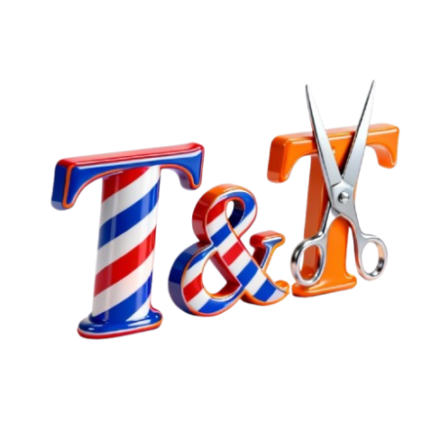

# 💈 Barbershop Appointment Management System

  
  
  
  
  
  

## 🚀 Overview
A comprehensive full-stack appointment management platform enabling clients to book online reservations with preferred barbers and real-time availability tracking. Features automated appointment reminders, dynamic service catalog, and intelligent waitlist functionality.

## ✨ Key Features
- **🔐 Role-Based Authentication** - Secure login for clients, barbers, and admins
- **📅 Real-Time Booking** - Live availability with instant confirmation
- **📊 Analytics Dashboard** - Business insights and performance metrics
- **🔔 Automated Notifications** - Email/SMS appointment reminders
- **⏳ Waitlist Management** - Queue system for fully booked slots

## 🛠️ Technology Stack

**Backend:** Java 17+, Spring Boot, Spring Security, Spring Data JPA, Hibernate, MySQL, Maven

**Frontend:** React 18+, JavaScript ES6+, HTML5, CSS3

**Architecture:** RESTful API, MVC Pattern, Dependency Injection, DTO Pattern
